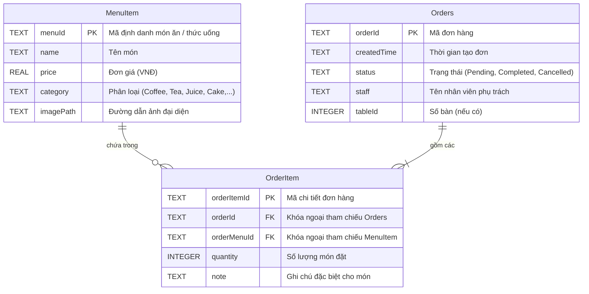

# ☕ Coffee Shop Management System (CSMS)

<div align="center">


**Ứng dụng máy tính (Desktop Application) hỗ trợ quản lý vận hành, bán hàng và điều hành quán cà phê chuyên nghiệp.**  
*Xây dựng trên nền tảng Java 21, giao diện JavaFX hiện đại, hỗ trợ Dark Mode, đa ngôn ngữ và cơ sở dữ liệu SQLite tích hợp sẵn.*

[Tính năng chính](#-tính-năng-nổi-bật) •
[Cài đặt & Khởi chạy](#-hướng-dẫn-cài-đặt--khởi-chạy) •
[Tài khoản mẫu](#-tài-khoản-thử-nghiệm) •
[Kiến trúc hệ thống](#-kiến-trúc--công-nghệ) •
[Cơ sở dữ liệu](#-mô-hình-cơ-sở-dữ-liệu) •
[Khắc phục sự cố](#-xử-lý-sự-cố-thường-gặp)

</div>

---

## 📖 Giới thiệu tổng quan

**Coffee Shop Management System** là phần mềm quản lý quán cà phê dạng máy trạm (Desktop POS & Management). Ứng dụng hỗ trợ tối đa quy trình từ khâu gọi món, tính tiền, in hóa đơn tạm tính đến khâu quản lý danh mục thực đơn, phân quyền tài khoản và cấu hình giao diện.

Dự án được tối ưu hóa theo mô hình phân lớp rõ ràng (**Layered MVC Architecture**), đi kèm toàn bộ thư viện SDK (JavaFX, SQLite JDBC và native runtime DLLs) giúp người dùng **khởi chạy ngay lập tức mà không cần cài đặt thêm thư viện ngoài**.

---

## ✨ Tính năng nổi bật

### 1. 🛒 Bán hàng & Gọi món (POS - Point of Sale)
- **Menu trực quan theo thẻ (Card Grid)**: Hiển thị hình ảnh món, tên, phân loại và giá bán được format chuẩn tiền tệ Việt Nam (`VNĐ`).
- **Bộ lọc & Tìm kiếm tức thì**: Lọc theo danh mục (`Tất cả`, `Đồ uống`, `Đồ ăn`) và thanh tìm kiếm thời gian thực.
- **Giỏ hàng linh hoạt**:
  - Thêm món nhanh chóng bằng một cú nhấp chuột.
  - Tăng/giảm số lượng món trực tiếp trên bảng order.
  - Xóa từng món hoặc hủy toàn bộ đơn gọi.
  - Tự động tính toán phụ phí, chiết khấu và tổng hóa đơn thanh toán.

### 2. 💳 Thanh toán đa phương thức (Smart Checkout)
- **Tiền mặt (Cash)**: Tính toán nhanh tiền nhận và tiền thối.
- **Thẻ ngân hàng (Card)**: Hỗ trợ quy trình quẹt thẻ máy POS.
- **Chuyển khoản / Ví điện tử (QR Pay)**: Tích hợp mã VietQR trực quan trên màn hình thanh toán, giúp khách hàng quét mã thanh toán bằng app ngân hàng tiện lợi.

### 3. 📋 Quản lý thực đơn (Menu Management - Dành cho Quản lý)
- **Phân quyền chặt chẽ**: Chỉ tài khoản có vai trò `Manager` mới có quyền truy cập trang quản lý thực đơn.
- **Thao tác CRUD toàn diện**: Thêm món mới, cập nhật giá, chỉnh sửa tên, phân loại đồ uống/đồ ăn và xóa món khỏi thực đơn.
- **Tải ảnh món tự động**: Cho phép chọn ảnh từ máy tính, tự động sao chép và lưu trữ an toàn trong thư mục tài nguyên dự án.

### 4. 🌓 Giao diện & Trải nghiệm người dùng (UX/UI)
- **Hỗ trợ Dark Mode & Light Mode**: Chuyển đổi giao diện sáng/tối mượt mà thông qua CSS hiện đại.
- **Đa ngôn ngữ (i18n)**: Chuyển đổi linh hoạt giữa **Tiếng Việt** và **English** mà không cần khởi động lại ứng dụng.
- **Hiệu ứng chuyển cảnh**: Ứng dụng JavaFX Transition Animations (Fade, Slide, Pseudo-class `:shown`) tạo cảm giác phản hồi cao cấp.

### 5. 🔐 Bảo mật & Quản lý tài khoản
- Đăng nhập, đăng ký tài khoản mới và lưu thông tin đăng nhập (**Remember Me**).
- Đổi mật khẩu tài khoản trực tiếp trong trang Cài đặt.
- Phân quyền người dùng theo hai cấp độ: **Manager (Quản lý)** và **Staff (Nhân viên)**.

---

## 🔑 Tài khoản thử nghiệm

Hệ thống được thiết lập sẵn hai tài khoản mặc định phục vụ việc kiểm thử nhanh:

| Tên đăng nhập (`Username`) | Mật khẩu (`Password`) | Vai trò (`Role`) | Quyền hạn |
| :--- | :--- | :--- | :--- |
| **`admin`** | `123456` | **Manager** | Đầy đủ quyền: Bán hàng, Quản lý thực đơn, Cài đặt hệ thống |
| **`staff`** | `123456` | **Staff** | Bán hàng (POS), Thanh toán đơn hàng, Cài đặt cá nhân |

> 💡 **Mẹo**: Bạn cũng có thể nhấn vào liên kết **"Đăng ký ngay"** ở màn hình đăng nhập để tạo thêm tài khoản mới.

---

## 💻 Yêu cầu hệ thống

- **Hệ điều hành**: Windows 10/11 (được khuyến nghị), macOS hoặc Linux.
- **Java Runtime**: **JDK 21 trở lên** (Oracle OpenJDK, Eclipse Temurin, BellSoft Liberica, v.v.).
- **Bộ nhớ RAM**: Tối thiểu 4 GB (Khuyến nghị 8 GB).
- **Thư viện đi kèm**: Tất cả file JAR (**JavaFX 21 SDK**, **SQLite JDBC 3.51.0.0**) và file `.dll` native đã có sẵn trong thư mục `lib/` và `bin/`.

---

## 🚀 Hướng dẫn cài đặt & Khởi chạy

### Cách 1: Chạy 1-Click bằng Script (Khuyên dùng trên Windows)

#### 🔹 Sử dụng Command Prompt (Batch script):
Chỉ cần nhấp đúp chuột vào file **`run.bat`** tại thư mục gốc, hoặc chạy từ CMD:
```cmd
run.bat
```

#### 🔹 Sử dụng PowerShell:
Mở PowerShell tại thư mục dự án và thực thi:
```powershell
.\run.ps1
```
*Nếu gặp thông báo chặn chính sách thực thi của Windows, hãy chạy lệnh:*
```powershell
powershell -ExecutionPolicy Bypass -File .\run.ps1
```

---

### Cách 2: Khởi chạy thủ công từ dòng lệnh (Terminal / CMD)

Nếu bạn muốn tự biên dịch và khởi chạy từng bước:

1. **Chuẩn bị thư mục build và sao chép tài nguyên tĩnh (FXML, CSS, hình ảnh, i18n):**
   ```cmd
   if not exist out mkdir out
   xcopy /E /Y /I src out
   del /S /Q out\*.java
   ```

2. **Biên dịch toàn bộ mã nguồn Java:**
   ```cmd
   dir /s /b src\*.java > sources.txt
   javac --module-path lib --add-modules javafx.controls,javafx.fxml,javafx.graphics,javafx.media,javafx.web -cp "lib/*" -d out @sources.txt
   del sources.txt
   ```

3. **Khởi động ứng dụng:**
   ```cmd
   java --module-path lib --add-modules javafx.controls,javafx.fxml,javafx.graphics,javafx.media,javafx.web -cp "out;lib/sqlite-jdbc-3.51.0.0.jar" view.Main
   ```

---

### Cách 3: Cấu hình trên IntelliJ IDEA / Eclipse / VS Code

#### Dành cho IntelliJ IDEA:
1. Mở thư mục dự án trong IntelliJ IDEA (`File -> Open...`).
2. Vào **File** ➔ **Project Structure...** ➔ **Project**:
   - Đặt **SDK** thành **JDK 21**.
3. Vào tab **Libraries**:
   - Thêm tất cả các file `.jar` trong thư mục `lib/` vào Project Libraries.
4. Mở file [Main.java](file:///d:/Downloads/project/Coffee-shop-management-main/src/view/Main.java) (`src/view/Main.java`).
5. Vào **Edit Run/Debug Configurations**:
   - Chọn mục **Modify options** ➔ **Add VM options**.
   - Dán chuỗi tham số sau vào ô VM options:
     ```text
     --module-path "lib" --add-modules javafx.controls,javafx.fxml,javafx.graphics,javafx.media,javafx.web
     ```
6. Bấm **Apply** và nhấn nút **Run** (Shift + F10).

---

## 🏗️ Kiến trúc & Công nghệ

### 1. Ngăn xếp công nghệ (Technology Stack)
- **Ngôn ngữ**: Java 21 LTS
- **Giao diện (UI)**: JavaFX 21 (FXML + CSS Modular Styling)
- **Cơ sở dữ liệu**: SQLite 3 (kết nối qua `sqlite-jdbc-3.51.0.0.jar`)
- **Quốc tế hóa**: Java ResourceBundle (`src/i18n/message_*.properties`)
- **Lưu trữ cấu hình**: Java Preferences API (`java.util.prefs.Preferences`)

### 2. Sơ đồ luồng kiến trúc (MVC + DAO Pattern)

```text
       ┌────────────────────────┐
       │   Giao diện người dùng  │ (FXML & CSS View)
       │ (Login, POS, Settings) │
       └───────────┬────────────┘
                   │ Sự kiện (Action Events / Bindings)
                   ▼
       ┌────────────────────────┐
       │      Controllers       │ (MainController, MenuController, v.v.)
       └───────────┬────────────┘
                   │ Gọi nghiệp vụ
                   ▼
       ┌────────────────────────┐
       │     Service Layer      │ (MenuService, OrderService, AuthService)
       └───────────┬────────────┘
                   │ Truy vấn dữ liệu
                   ▼
       ┌────────────────────────┐
       │       DAO Layer        │ (MenuDAO, OrderDAO)
       └───────────┬────────────┘
                   │ JDBC Driver
                   ▼
       ┌────────────────────────┐
       │     SQLite Database    │ (storage/coffee_shop.db)
       └────────────────────────┘
```

---

## 🗄️ Mô hình cơ sở dữ liệu

Cơ sở dữ liệu SQLite được lưu trữ tại file cục bộ: `storage/coffee_shop.db`. Khi khởi động ứng dụng lần đầu, hệ thống sẽ tự động kích hoạt `CreateDatabase` và `DataSeeder` để tạo bảng và nạp sẵn menu mẫu.



---

## 📂 Cấu trúc thư mục dự án

```
Coffee-shop-management/
├── bin/                             # Thư viện native DLL hỗ trợ JavaFX
├── lib/                             # Thư viện JavaFX SDK và SQLite JDBC JARs
│   ├── javafx.controls.jar
│   ├── javafx.fxml.jar
│   ├── javafx.graphics.jar
│   ├── sqlite-jdbc-3.51.0.0.jar
│   └── ...
├── storage/
│   └── coffee_shop.db               # Cơ sở dữ liệu SQLite chính
├── src/
│   ├── DAO/                         # Tầng truy xuất dữ liệu (MenuDAO, OrderDAO)
│   ├── Database/                    # Khởi tạo DB (CreateDatabase) & Seeder (DataSeeder)
│   ├── Interface/                   # Các Interface hợp đồng (IMenuItem, IOrder, v.v.)
│   ├── i18n/                        # File ngôn ngữ (message_vi.properties, message_en.properties)
│   ├── model/                       # Thực thể dữ liệu (MenuItem, Order, OrderItem, User, Staff, Manager)
│   ├── service/                     # Xử lý logic nghiệp vụ (MenuService, OrderService)
│   └── view/                        # Tầng hiển thị giao diện
│       ├── Main.java                # Điểm khởi chạy ứng dụng (Entry Point)
│       ├── AppConfig.java           # Cấu hình chủ đề & thiết lập chung
│       ├── Helper/                  # Tiện ích chuyển ngữ (LanguageManager), lưu ảnh (SaveImage)
│       ├── LoginPage/               # Giao diện & Controller Đăng nhập / Đăng ký
│       ├── MainScreen/              # Màn hình chính bán hàng, Menu Grid & DarkMode CSS
│       │   ├── MenuManagerPage/     # Màn hình quản lý món (Thêm, Sửa, Xóa món)
│       │   └── SettingsPage/        # Màn hình đổi mật khẩu, chọn ngôn ngữ & theme
│       ├── MockTest/                # Mock dịch vụ xác thực tài khoản & người dùng
│       ├── PaymentPage/             # Giao diện & xử lý thanh toán (Tiền mặt, Thẻ, VietQR)
│       └── Wrapper/                 # Wrapper tương thích JavaFX TableView property
├── run.bat                          # Script 1-click khởi chạy tự động trên Windows (CMD)
├── run.ps1                          # Script 1-click khởi chạy tự động trên Windows (PowerShell)
├── .gitignore                       # Danh sách file & thư mục loại trừ khỏi Git
└── README.md                        # Tài liệu hướng dẫn sử dụng dự án
```

---

## 🛠️ Xử lý sự cố thường gặp

### 1. Lỗi `JavaFX runtime components are missing`
- **Nguyên nhân**: Thiếu tham số `--module-path` và `--add-modules` khi chạy lệnh `java`.
- **Giải pháp**: Đảm bảo đã chỉ định đúng đường dẫn tới thư mục `lib/`:
  ```bash
  --module-path lib --add-modules javafx.controls,javafx.fxml,javafx.graphics,javafx.media,javafx.web
  ```

### 2. Lỗi `cannot be loaded because running scripts is disabled on this system` (PowerShell)
- **Nguyên nhân**: Chính sách `ExecutionPolicy` của PowerShell chặn chạy script `.ps1`.
- **Giải pháp**: Mở PowerShell với quyền Administrator và chạy lệnh:
  ```powershell
  Set-ExecutionPolicy -Scope CurrentUser -ExecutionPolicy RemoteSigned
  ```
  Hoặc chỉ định trực tiếp khi chạy file:
  ```powershell
  powershell -ExecutionPolicy Bypass -File .\run.ps1
  ```

### 3. Lỗi font chữ hoặc ký tự tiếng Việt hiển thị sai trong Console
- **Giải pháp**: Chuyển mã hóa console sang UTF-8 trước khi chạy:
  ```cmd
  chcp 65001
  ```

---

## 👥 Đóng góp & Phát triển

Mọi đóng góp, báo lỗi (Issues) hoặc yêu cầu tính năng mới (Pull Requests) đều rất được hoan nghênh:
1. Fork dự án về tài khoản cá nhân.
2. Tạo nhánh tính năng mới (`git checkout -b feature/AmazingFeature`).
3. Commit các thay đổi (`git commit -m "feat: Add new awesome feature"`).
4. Đẩy mã nguồn lên nhánh (`git push origin feature/AmazingFeature`).
5. Mở một **Pull Request** trên GitHub.

---

## 📄 Bản quyền (License)

Dự án được phân phối dưới giấy phép **MIT License**. Bạn hoàn toàn có thể tự do học tập, sử dụng và phát triển mở rộng cho các mục đích học tập hoặc thương mại.
